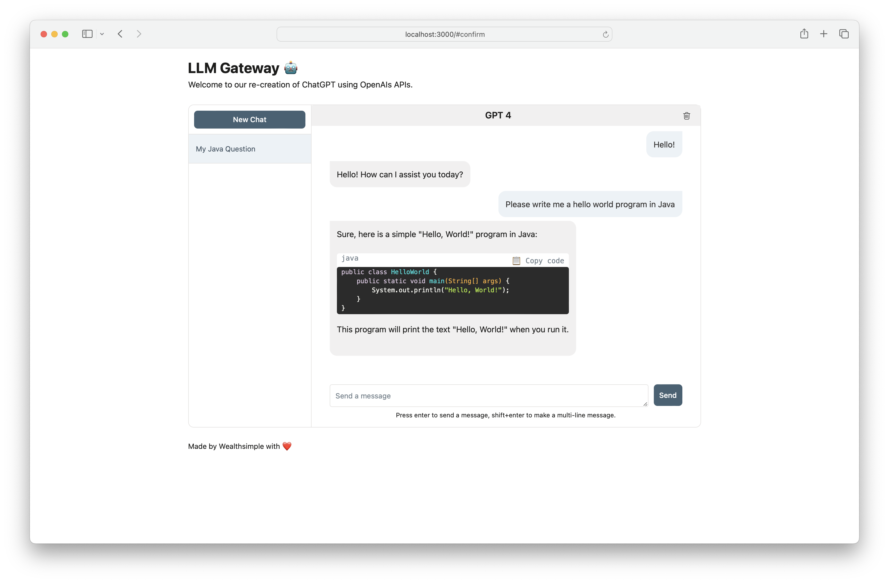

# LLM Gateway

<p align="center">
  
</p>

## 🤔 What is this?

`llm-gateway` is a gateway for third party LLM providers such as OpenAI, Cohere, etc. It tracks data sent and received from these providers in a postgres database and runs PII scrubbing heuristics prior to sending.

Per OpenAI's non-API consumer products [data usage policy](https://help.openai.com/en/articles/7039943-data-usage-for-consumer-services-faq), they "may use content such as prompts, responses, uploaded images, and generated images to improve our services" to improve products like ChatGPT and DALL-E.

Use `llm-gateway` to interact with OpenAI in a safe manner. The gateway also recreates the ChatGPT frontend using OpenAI's `/ChatCompletion` endpoint to keep all communication within the API.

## ⚒️ Usage

The provider's API key needs to be saved as an environment variable (see setup further down). If you are communicating with OpenAI, set `OPENAI_API_KEY`.

For step-by-step setup instructions with Cohere, OpenAI, and AWS Bedrock, click [here](llm_gateway/README.md).

### API Usage
[OpenAI] Example cURL to `/completion` endpoint:
```
curl -X 'POST' \
  'http://<host>/api/openai/completion' \
  -H 'accept: application/json' \
  -H 'Content-Type: application/json' \
  -d '{
  "temperature": 0,
  "prompt": "Tell me what is the meaning of life",
  "max_tokens": 50,
  "model": "text-davinci-003"
}'
```

[OpenAI] When using the `/chat_completion` endpoint, formulate as conversation between user and assistant.
```
curl -X 'POST' \
  'http://<host>/api/openai/chat_completion' \
  -H 'accept: application/json' \
  -H 'Content-Type: application/json' \
  -d '{
  "messages": [
    {"role": "assistant", "content": "You are an intelligent assistant."},
    {"role": "user", "content": "create a healthy recipe"}
  ],
  "model": "gpt-3.5-turbo",
  "temperature": 0
}'
```

### Python Usage

```python3
from llm_gateway.providers.openai import OpenAIWrapper

wrapper = OpenAIWrapper()
wrapper.send_openai_request(
    "Completion",
    "create",
    max_tokens=100,
    prompt="What is the meaning of life?",
    temperature=0,
    model="text-davinci-003",
)
```

## 🚀 Quick Start for Developers

This project uses Poetry, Pyenv for dependency and environment management. Check out the official installation documentation for [Poetry](https://python-poetry.org/docs/#installing-with-the-official-installer) and [Pyenv](https://github.com/pyenv/pyenv) to get started.
For front-end portion, this project use npm and yarn for dependency management. The most up-to-date node version required for this project is declared in [.node-version](./front_end/.node-version).

### Backend Dependencies

If using Docker, steps 1-3 are optional. We recommend installing pre-commit hooks to speed up the development cycle.

1. Install Poetry and Pyenv
2. Install `pyenv install 3.11.3`
3. Install project requirements
```
brew install gitleaks
poetry install
poetry run pre-commit install
```
4. Run `cp .envrc.example .envrc` and update with API secrets

### 🐳 Docker Development Loop (backend & frontend)

To run in Docker:

```
# spin up docker-compose
make up

# open frontend in browser
make browse

# open FastAPI Swagger API
make browse-api

# delete docker-compose setup
make down
```
